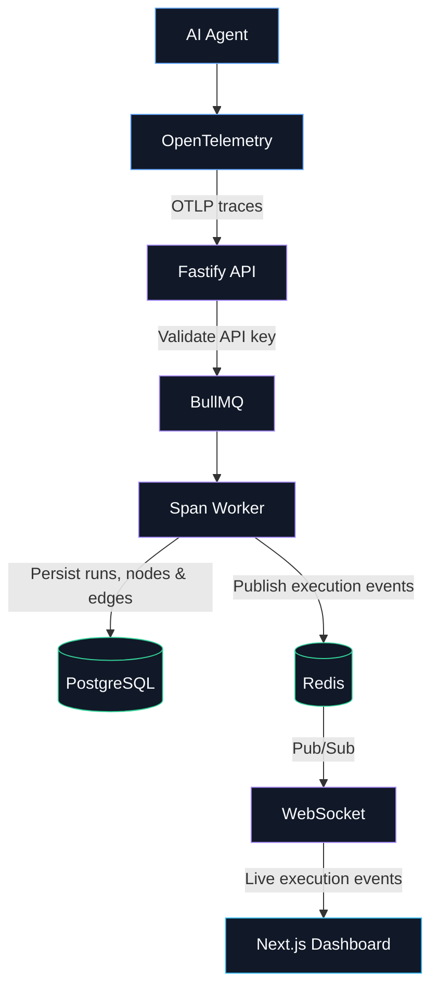

<div align="center">


# Beacon

### Observability for AI Workflows

See what's happening inside your AI workflows — in real time.

[](https://nextjs.org/)
[](https://fastify.dev/)
[](https://www.typescriptlang.org/)
[](https://www.postgresql.org/)
[](https://redis.io/)
[](https://opentelemetry.io/)

<br />

[Live Demo](https://beacon-web-mu.vercel.app/)

</div>

---

## What is Beacon?

Beacon is an observability platform for AI workflows that turns OpenTelemetry traces into a real-time visual representation of their execution.

When an agent runs, it may make LLM calls, invoke tools, read and write files, run commands, and perform many operations before producing a final result. Beacon captures those operations through OpenTelemetry and turns them into an execution graph, so you can see what the agent is doing, how the steps are connected, and where a run succeeds or fails.

Instead of digging through logs after an agent finishes, Beacon lets you watch the execution as it happens and inspect completed runs afterward.

If your agent already emits OpenTelemetry traces, you can point those traces at Beacon without changing the core agent workflow.

---

## The Problem

An agent might execute something like:

```text
User Request
     │
     ▼
Agent
     │
     ├── LLM Call
     │
     ├── Read File
     │
     ├── Run Command
     │
     ├── Write File
     │
     └── Build Project
```

From the outside, you may only see:

```text
Task completed successfully.
```

Beacon makes the execution path visible:

```text
                    Agent Workflow
                         │
          ┌──────────────┼──────────────┐
          │              │              │
      LLM Call       Read File      Run Command
                                         │
                                    Write File
                                         │
                                    Build Project
```

The goal is simple:

> **Turn the black box execution of an AI agent into something you can see and understand.**

---

## What Beacon Gives You

### Real-time execution graphs

Watch an agent's execution as it happens.

Every OpenTelemetry span becomes part of the execution graph, with parent-child relationships represented as connections between nodes.

### Tool & agent visibility

See the individual operations performed during a run, including instrumented tool calls and agent steps.

### Run history

Completed executions remain available for inspection.

You can go back to a run and understand what happened without relying on terminal logs.

### Live updates

The dashboard receives execution updates through WebSockets while a run is still in progress.

### OpenTelemetry native

Beacon is built around OpenTelemetry rather than a proprietary instrumentation format.

If your agent already emits OTEL traces, Beacon can consume them through its OTLP ingestion endpoint.

---

## Architecture

The system is intentionally split into an ingestion path and a real-time visualization path.



### Data Flow

There are two important paths through Beacon.

#### 1. Telemetry ingestion

```text
AI Agent
    │
    │ OpenTelemetry
    ▼
POST /v1/traces
    │
    │ API key validation
    ▼
BullMQ
    │
    ▼
Span Worker
    │
    ├──────────────► PostgreSQL
    │
    └──────────────► Redis
```

The HTTP ingestion layer validates the API key and places incoming telemetry into BullMQ.

The worker then processes the span asynchronously and persists the resulting run, node, and edge data.

#### 2. Live visualization

```text
Span Worker
     │
     ▼
Redis Pub/Sub
     │
     ▼
WebSocket
     │
     ▼
Next.js Dashboard
```

This allows the dashboard to update while the agent is still running instead of repeatedly polling the database.

Historical run data follows the normal API path:

```text
PostgreSQL
     │
     ▼
Fastify API
     │
     ▼
Next.js Dashboard
```

---

## How Beacon Maps Traces to a Graph

Beacon uses the structure already present in OpenTelemetry traces.

A trace can contain spans such as:

```text
Agent Workflow
    │
    ├── LLM Call
    │
    ├── Read File
    │
    ├── Run Command
    │
    └── Write File
```

Beacon maps these into:

```text
OpenTelemetry Span → Node
Parent Span        → Edge
Trace              → Run
```

The result is a DAG representing the execution path of the agent.

This means the graph is derived from telemetry relationships rather than being manually constructed by the agent.

---

## Built Around OpenTelemetry

Beacon does not require an agent to be rewritten specifically for Beacon.

The basic integration is:

```text
Your Agent
    │
    ▼
OpenTelemetry
    │
    ▼
Beacon OTLP Endpoint
    │
    ▼
Real-time Execution Graph
```

For example:

```bash
OTEL_EXPORTER_OTLP_TRACES_ENDPOINT=https://beacon-production-b710.up.railway.app/v1/traces
OTEL_EXPORTER_OTLP_TRACES_PROTOCOL=http/json
OTEL_EXPORTER_OTLP_TRACES_HEADERS="x-api-key=YOUR_BEACON_API_KEY"
OTEL_SERVICE_NAME="my-agent"
```

The exact instrumentation depends on the agent framework and OpenTelemetry setup, but Beacon's ingestion layer works with the resulting OTLP trace data.

---

## Tech Stack

| Layer | Technology |
|---|---|
| Frontend | Next.js, React, TypeScript |
| Visualization | React Flow |
| Backend | Fastify, TypeScript |
| Database | PostgreSQL |
| ORM | Prisma |
| Queue | BullMQ |
| Realtime | Redis Pub/Sub + WebSockets |
| Telemetry | OpenTelemetry |
| Authentication | Clerk |
| Validation | Zod |
| Monorepo | pnpm + Turborepo |
| Deployment | Vercel + Railway |

---

## Engineering Highlights

### Asynchronous ingestion

Telemetry ingestion is separated from database processing.

```text
HTTP Request
     │
     ▼
Validate
     │
     ▼
Enqueue
     │
     ▼
Return
```

The worker handles persistence independently:

```text
BullMQ
   │
   ▼
Span Worker
   │
   ├── Find / Create Run
   ├── Create Node
   ├── Resolve Parent
   ├── Create Edge
   └── Persist Data
```

### Idempotent span processing

Span IDs are treated as unique identifiers so repeated telemetry does not create duplicate nodes.

### Event-driven realtime updates

Instead of continuously polling PostgreSQL for changes, processed events are published through Redis and delivered to connected dashboards through WebSockets.

### Workspace-scoped API keys

Telemetry ingestion is authenticated using workspace API keys, while dashboard users authenticate through Clerk.

---

## Load Testing

The production OTLP ingestion endpoint was tested with authenticated concurrent clients.

| Concurrency | Requests | Throughput | p50 | p95 | p99 | Errors |
|---:|---:|---:|---:|---:|---:|---:|
| 10 | 397 | 38.79 req/s | 228.34 ms | 545.32 ms | 734.50 ms | 0% |
| 25 | 1,018 | 99.52 req/s | 224.96 ms | 272.88 ms | 800.05 ms | 0% |
| 50 | 2,031 | 198.57 req/s | 224.98 ms | 396.84 ms | 701.64 ms | 0% |
| 100 | 4,015 | 377.95 req/s | 223.95 ms | 289.30 ms | 912.69 ms | 0% |

At 100 concurrent clients, the production ingestion endpoint processed **4,015 authenticated requests over 10.62 seconds with 0% HTTP request failures**, reaching **377.95 requests/second**.

These measurements represent **OTLP ingestion throughput**, not complete agent execution throughput. Telemetry processing continues asynchronously through BullMQ.

---

## Repository Structure

```text
Beacon/
│
├── apps/
│   ├── api/                  # Fastify backend
│   │   ├── prisma/           # Database schema & migrations
│   │   └── src/
│   │       ├── config/
│   │       ├── controllers/
│   │       ├── lib/
│   │       ├── modules/
│   │       ├── plugins/
│   │       ├── routes/
│   │       └── workers/
│   │
│   └── web/                  # Next.js dashboard
│       ├── app/
│       ├── components/
│       ├── hooks/
│       └── lib/
│
├── docker-compose.yml
├── package.json
├── pnpm-workspace.yaml
├── turbo.json
└── README.md
```

More detailed implementation documentation lives inside the individual applications.

- [`apps/api/README.md`](./apps/api/README.md) — backend architecture, ingestion, workers, database, and API
- [`apps/web/README.md`](./apps/web/README.md) — dashboard architecture, DAG visualization, WebSockets, and frontend

---

## Getting Started

### Requirements

- Node.js 22+
- pnpm 9+
- Docker
- PostgreSQL
- Redis

### Clone the repository

```bash
git clone https://github.com/Akhilesh-Singh-0/Beacon.git
cd Beacon
```

### Install dependencies

```bash
pnpm install
```

### Start infrastructure

```bash
docker compose up -d
```

### Configure environment variables

Configure the backend environment in:

```text
apps/api/.env
```

At minimum, the backend requires the database, Redis, and Clerk configuration used by the application.

For the frontend, configure:

```text
apps/web/.env.local
```

with the required API and Clerk variables.

### Start the development environment

```bash
pnpm dev
```

---

## Production

Beacon currently runs as:

```text
Frontend
   │
   ▼
Vercel
   │
   ▼
Next.js Dashboard


Backend
   │
   ▼
Railway
   │
   ├── Fastify API
   ├── PostgreSQL
   └── Redis
```

### Production API

```text
https://beacon-production-b710.up.railway.app
```

Health check:

```text
https://beacon-production-b710.up.railway.app/health
```

---

## Why I Built This

While building AI agents, I kept running into the same problem:

**I could see the output, but I couldn't really see what was happening in between.**

Once an agent starts calling tools, reading files, running commands, and making multiple LLM calls, a stream of logs becomes difficult to reason about.

I wanted something that showed the execution itself.

So I built Beacon around a simple idea:

```text
Telemetry
    ↓
Execution Graph
    ↓
Clearer Understanding
```

Beacon is an ongoing project focused on making AI agent execution easier to observe, debug, and understand.

---

## Contributing

Beacon is being built with an open-source mindset.

If you want to contribute:

```bash
git clone https://github.com/Akhilesh-Singh-0/Beacon.git
cd Beacon
pnpm install
pnpm dev
```

Before contributing, take a look at the architecture above and the application-specific READMEs.

The most useful contributions will generally start by understanding **where a change belongs in the existing data flow** rather than adding logic directly to the ingestion path.

---

## Roadmap

Beacon's current foundation can be extended in several directions:

- More agent framework integrations
- Richer trace and span inspection
- Advanced run filtering
- Search across executions
- Deeper error analysis
- More detailed cost analytics
- Additional telemetry support
- Improved collaboration features
- Larger-scale ingestion and processing

---

## License

MIT

---

<div align="center">

### Beacon

**Observability for AI Agents**

See what your AI agents are doing — in real time.

[GitHub](https://github.com/Akhilesh-Singh-0/Beacon)

</div>

<div align="center">
  <sub>If this was useful or interesting — a ⭐ goes a long way.</sub>
</div>
