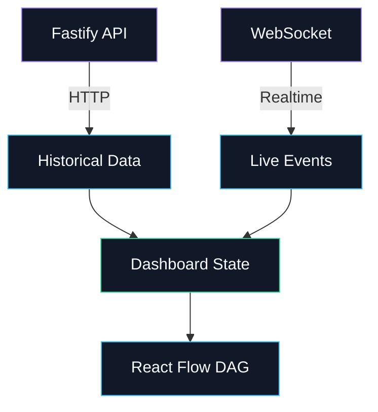

<div align="center">

  

  <h1>Beacon Web</h1>

  <p>AI workflow observability dashboard</p>

  <p><em>Next.js dashboard for visualizing AI workflow executions as real-time execution graphs with OpenTelemetry, React Flow, WebSockets, and Clerk authentication.</em></p>

  <p>
    
    
    
    
    
    
    
  </p>

  <p>
    <a href="https://beacon-web-mu.vercel.app"><strong>Live Demo</strong></a>
  </p>

  <p>
    <a href="../../README.md"><strong>Beacon README</strong></a> ·
    <a href="../api/README.md"><strong>Backend README</strong></a>
  </p>

</div>

---

## What This Does

The Beacon Web application is the dashboard for exploring and monitoring AI workflow executions.

Instead of looking through a stream of logs, the dashboard turns OpenTelemetry spans into a visual execution graph.

```text
AI Workflow
   ↓
OpenTelemetry
   ↓
Beacon API
   ↓
Execution Data
   ↓
Next.js Dashboard
   ↓
React Flow DAG
```

The dashboard supports both completed executions and live runs.

For a running agent, new execution events can appear in the graph without requiring a page refresh.

---

## Core Experience

The main workflow is:

```text
Sign in
   ↓
Onboarding
   ↓
Run History
   ↓
Open a Run
   ↓
Inspect Execution Graph
   ↓
Watch Live Updates
```

Beacon is designed around the idea that AI workflow execution should be something you can **see**, not just something you can read through logs.

---

## Architecture

The frontend sits on top of two communication paths:



### HTTP

HTTP is used for persisted application state.

For example:

```text
Run History
    ↓
GET runs

Run Details
    ↓
GET run graph
```

This gives the dashboard a reliable initial state when a user opens a run.

### WebSocket

WebSockets are used for execution events that happen after the page has loaded.

```text
Span Worker
     ↓
Redis Pub/Sub
     ↓
WebSocket
     ↓
Browser
     ↓
React Flow
```

This allows the execution graph to evolve while the agent is still running.

---

## Real-Time Execution

The run detail page combines an initial HTTP request with a live WebSocket connection.

```text
User opens run
      │
      ▼
Fetch current run state
      │
      ▼
Render existing nodes
      │
      ▼
Connect to WebSocket
      │
      ▼
Receive execution events
      │
      ├── node.created
      │
      ├── node.updated
      │
      ├── edge.created
      │
      └── run.updated
      │
      ▼
Update dashboard
      │
      ▼
React Flow re-renders graph
```

This separation is important.

The frontend does not need to repeatedly poll the API to discover whether a workflow has progressed.

---

## DAG Visualization

The execution graph is the central part of the Beacon interface.

React Flow is used to render:

```text
Nodes
  +
Edges
  ↓
Execution Graph
```

Each node represents an operation within the workflow execution.

For example:

```text
Agent Workflow
      │
      ├──────────────┐
      ▼              ▼
 Read Files      Run Command
      │              │
      ▼              ▼
 Write Files      Install
      │              │
      └──────┬───────┘
             ▼
          Build
```

The graph preserves the parent-child relationships represented by the OpenTelemetry spans.

This makes it possible to understand the execution path instead of reconstructing it manually from logs.

---

## Run States

The dashboard displays the overall state of a workflow execution.

```text
RUNNING
COMPLETED
FAILED
```

A typical lifecycle is:

```text
RUNNING
   │
   ├── successful execution ──→ COMPLETED
   │
   └── execution error ───────→ FAILED
```

The final run state is received through the backend's execution events.

---

## Node States

Individual execution nodes can have their own state:

```text
PENDING
RUNNING
SUCCESS
ERROR
STUCK
```

The frontend uses these states to communicate what is happening inside the execution graph.

For example:

```text
Agent
 │
 ├── SUCCESS
 │
 ├── RUNNING
 │
 └── PENDING
```

As events arrive, the corresponding node is updated in the graph.

---

## Run History

The `/runs` page provides an overview of previous executions.

The run history includes information such as:

```text
Run
Status
Start Time
Completion Time
Token Usage
Cost
```

The page also refreshes automatically so newly processed runs can appear without requiring a manual browser refresh.

Selecting a run opens:

```text
/runs/[runId]
```

where the full execution graph can be inspected.

---

## Run Details

The run detail page brings together:

```text
Run Status
Execution Details
Token Usage
Cost
Execution Graph
Live Events
```

The page supports both:

```text
Completed runs
```

and:

```text
Currently running executions
```

For an active run, the graph can continue changing while the user watches it.

For a completed run, the persisted execution graph can be explored after the workflow has finished.

---

## Authentication

Beacon uses Clerk for frontend authentication.

The frontend handles:

```text
Sign Up
Sign In
Session Management
Protected Routes
Authenticated User State
```

The application flow is:

```text
User
 ↓
Clerk
 ↓
Authenticated Session
 ↓
Beacon Dashboard
```

The dashboard routes are protected while public routes remain accessible where required.

---

## Onboarding

After authentication, Beacon provides an onboarding flow for connecting an instrumented application or workflow to the dashboard.

The onboarding experience provides the information required to send telemetry to Beacon.

The general flow is:

```text
Create account
      ↓
Create / access workspace
      ↓
Get Beacon API key
      ↓
Configure OTEL exporter
      ↓
Run workflow
      ↓
Watch execution in Beacon
```

API keys can also be regenerated from the dashboard when required.

---

## API Integration

The frontend communicates with the Beacon API through the configured API URL.

```text
Next.js
   │
   ├── HTTP ───────────────→ Fastify API
   │
   └── WebSocket ──────────→ WebSocket Server
```

HTTP is responsible for persisted data.

WebSockets are responsible for live execution updates.

This keeps the frontend's data model simple:

```text
Initial state
      ↓
HTTP

State changes
      ↓
WebSocket
```

---

## Frontend Data Flow

A complete run visualization looks like:

```text
AI Agent
   │
   ▼
OpenTelemetry
   │
   ▼
Beacon API
   │
   ▼
BullMQ
   │
   ▼
Span Worker
   │
   ├──────────────→ PostgreSQL
   │
   └──────────────→ Redis
                         │
                         ▼
                    WebSocket
                         │
                         ▼
                      Browser
                         │
                         ▼
                    React State
                         │
                         ▼
                    React Flow
```

The frontend does not process raw OpenTelemetry data itself.

It consumes the execution state produced by the Beacon backend and focuses on presenting it clearly.

---

## Project Structure

```text
apps/web/
├── app/
│   ├── api/
│   │   └── me/
│   │
│   ├── onboarding/
│   │
│   ├── runs/
│   │   ├── [runId]/
│   │   └── page.tsx
│   │
│   ├── sign-in/
│   ├── sign-up/
│   │
│   ├── globals.css
│   ├── layout.tsx
│   └── page.tsx
│
├── components/
│   ├── ui/
│   └── ...
│
├── hooks/
│   └── ...
│
├── lib/
│   └── ...
│
├── public/
│   └── ...
│
├── middleware.ts
├── next.config.ts
├── postcss.config.mjs
├── package.json
└── tsconfig.json
```

The important frontend boundaries are:

```text
app/
    Pages, routes and application entry points

components/
    Reusable UI and Beacon-specific components

hooks/
    Client-side state and realtime behavior

lib/
    Frontend utilities and API helpers

public/
    Static assets

middleware.ts
    Route protection and authentication middleware
```

---

## Component Architecture

The run detail interface is structured around the execution itself.

Conceptually:

```text
Run Detail
    │
    ├── Header
    │
    ├── Run Status
    │
    ├── Execution Details
    │
    └── DAG Canvas
          │
          ├── React Flow
          ├── Execution Nodes
          ├── Edges
          └── Viewport Controls
```

Reusable primitives are kept separate from Beacon-specific application components.

This makes the UI easier to extend without coupling every component to the execution graph.

---

## Design System

Beacon uses a dark developer-tool aesthetic focused on the execution graph.

The interface prioritizes:

- Clear execution states
- High information density
- Strong visual hierarchy
- Minimal visual noise
- Compact controls
- Consistent spacing
- Subtle animation
- Graph-first visualization

The dashboard is intentionally designed to feel like an engineering tool rather than a generic analytics dashboard.

---

## Technology Decisions

### Next.js

Next.js provides:

- Application routing
- Server/client component architecture
- Authentication integration
- Production deployment
- Frontend build tooling

### React Flow

React Flow is used because the core Beacon interface is a graph.

It provides the primitives needed for:

```text
Nodes
Edges
Zoom
Pan
Viewport controls
Interactive graph rendering
```

### WebSockets

WebSockets are used for live execution updates.

Polling would require the browser to repeatedly ask:

```text
"Did anything change?"
```

Instead, Beacon can push:

```text
"Something changed."
```

to the connected browser.

### Clerk

Clerk handles authentication and session management so the frontend does not need to implement authentication primitives itself.

### Tailwind CSS + UI primitives

Tailwind CSS and reusable UI primitives provide a consistent styling layer across the application.

---

## Environment Variables

Create:

```text
apps/web/.env.local
```

Example:

```env
NEXT_PUBLIC_API_URL=http://localhost:8000
BEACON_API_URL=http://localhost:8000

NEXT_PUBLIC_CLERK_PUBLISHABLE_KEY=pk_test_...
CLERK_SECRET_KEY=sk_test_...

NEXT_PUBLIC_CLERK_SIGN_IN_URL=/sign-in
NEXT_PUBLIC_CLERK_SIGN_UP_URL=/sign-up
NEXT_PUBLIC_CLERK_AFTER_SIGN_IN_URL=/runs
NEXT_PUBLIC_CLERK_AFTER_SIGN_UP_URL=/runs
```

For production:

```env
NEXT_PUBLIC_API_URL=https://beacon-production-b710.up.railway.app
BEACON_API_URL=https://beacon-production-b710.up.railway.app
```

Never commit:

```text
.env
.env.local
```

or any secret keys to Git.

---

## Local Development

### Prerequisites

- Node.js 22+
- pnpm 9+
- Running Beacon API
- Clerk application

---

### Install Dependencies

From the repository root:

```bash
pnpm install
```

---

### Configure Environment

Create:

```text
apps/web/.env.local
```

and configure the Clerk credentials and local Beacon API URL.

---

### Start the Frontend

```bash
pnpm --filter @beacon/web dev
```

The frontend will be available at:

```text
http://localhost:3000
```

---

### Build

```bash
pnpm --filter @beacon/web build
```

---

### Start Production Build

```bash
pnpm --filter @beacon/web start
```

---

## Production

The Beacon frontend is deployed on Vercel.

```text
Frontend
https://beacon-web-mu.vercel.app

Backend
https://beacon-production-b710.up.railway.app
```

Production architecture:

```text
                    User
                      │
                      ▼
                  Vercel
                      │
          ┌───────────┴───────────┐
          │                       │
         HTTP                 WebSocket
          │                       │
          ▼                       ▼
                    Railway
                  Beacon API
```

The frontend uses HTTP for persisted run data and WebSockets for live execution events.

---

## Current Frontend Capabilities

### Authentication

- [x] Clerk authentication
- [x] Sign in
- [x] Sign up
- [x] Protected application routes
- [x] Session handling

### Dashboard

- [x] Run history
- [x] Run detail pages
- [x] Run status
- [x] Execution details
- [x] Token usage
- [x] Cost display
- [x] Automatic run history refresh

### Execution Graph

- [x] React Flow DAG
- [x] Execution nodes
- [x] Parent-child edges
- [x] Node status visualization
- [x] Live node creation
- [x] Live node updates
- [x] Live edge creation
- [x] Run completion updates
- [x] Graph viewport fitting

### Real-Time

- [x] WebSocket connection
- [x] Run-specific execution updates
- [x] Live graph updates
- [x] Run status synchronization

### Onboarding

- [x] API key display
- [x] API key regeneration
- [x] Workflow connection setup

---

## Known Limitations

The frontend is still evolving alongside the Beacon backend.

Current limitations include:

- Very large execution graphs may require further layout optimization.
- The current visualization is primarily optimized for developer-facing AI workflows.
- Advanced filtering and search across large run histories are future improvements.
- The dashboard depends on the Beacon API for persisted state and realtime events.

---

## Related Documentation

- [Beacon README](../../README.md) — Product overview and system architecture
- [Beacon API README](../api/README.md) — Backend architecture, OpenTelemetry ingestion, queues, workers, PostgreSQL, Redis, and WebSockets

---

## License

MIT — use it, fork it, learn from it.

---

<div align="center">
  <sub>If this was useful or interesting — a ⭐ goes a long way.</sub>
</div>
